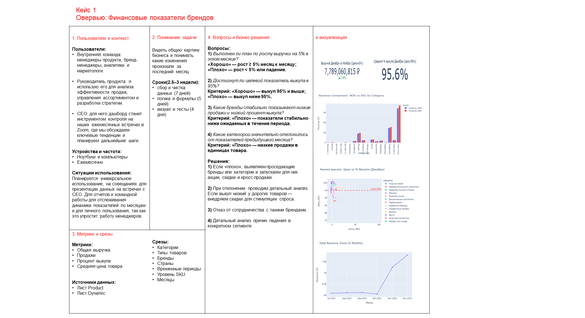
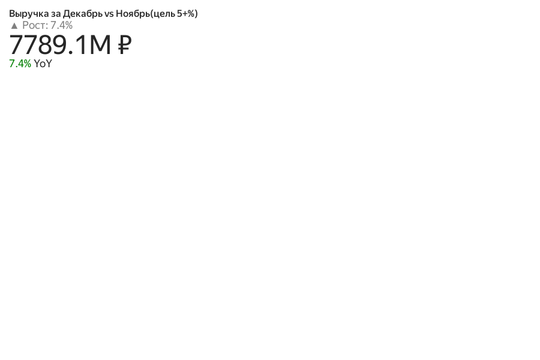
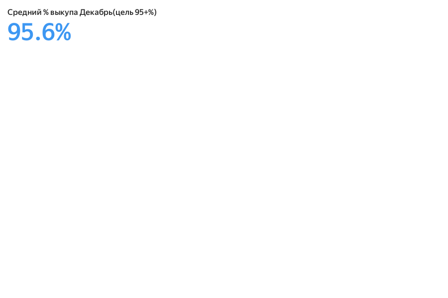
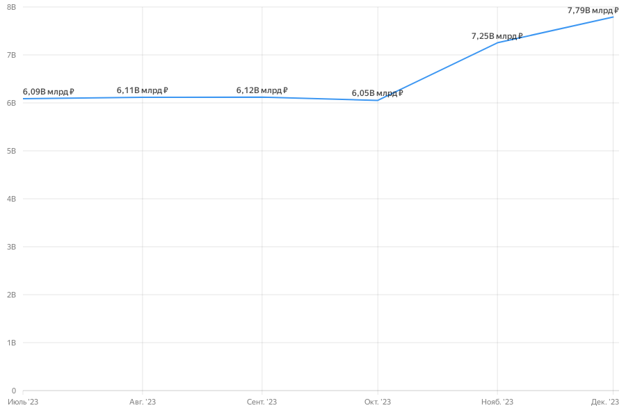
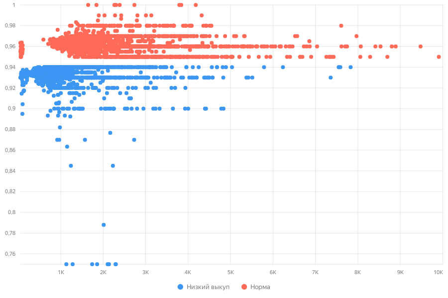
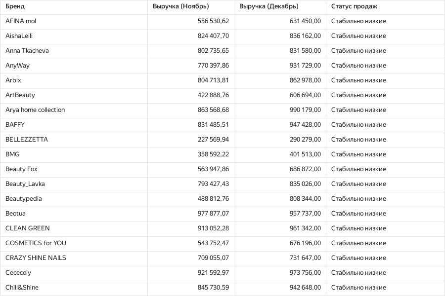

# Овервью: Финансовые показатели брендов

## О контексте и пользователях
Дашборд разработан для внутренней команды: менеджеров продукта, бренд-менеджеров, аналитиков и маркетологов. Главная цель инструмента — видеть общую картину бизнеса и понимать, какие изменения произошли за последний месяц. 

Руководитель продукта использует его для анализа эффективности продаж, управления ассортиментом и разработки стратегии. Для CEO дашборд служит инструментом контроля на ежемесячных встречах в Zoom, где обсуждаются ключевые тенденции и планируются дальнейшие шаги.

**Источники данных:** Лист Product и Лист Dynamic.
**Ключевые метрики:** Общая выручка, Продажи, Процент выкупа, Средняя цена товара.

---

## Этап 1: Проектирование (Dashboard Canvas)
Перед сборкой визуализаций были собраны требования и сформирован Canvas дашборда. Были поставлены ключевые вопросы:
1. Выполнен ли план по росту выручки на 5% в этом месяце?
2. Достигнут ли целевой показатель выкупа в 95%?
3. Какие бренды стабильно показывают низкие продажи и низкий процент выкупа?
4. Какие категории значительно отклонились от показателей предыдущего месяца? 

---

## Этап 2: Реализация в Yandex DataLens

### 1. Выполнение KPI (Декабрь)
Индикаторы показывают успешное выполнение главных целей бизнеса:
* Цель по росту выручки (≥ 5% месяц к месяцу) выполнена.
* Целевой показатель выкупа в 95% и выше успешно достигнут.

### 2. Динамика выручки
Тренд общей выручки за 6 месяцев (Июль '23 - Декабрь '23) демонстрирует уверенный рост в конце года до отметки 7.79 млрд ₽.

### 3. Матрица выкупа (Зависимость выкупа от цены)
Диаграмма рассеяния позволяет сегментировать товары на "Норму" и "Низкий выкуп". Если выкуп низкий у дорогих товаров — внедряем скидки для стимуляции спроса[cite: 29].

### 4. Контроль проблемных брендов
Детализированная таблица для отслеживания брендов, которые стабильно показывают низкие продажи в течение периода. На основе этих данных принимается бизнес-решение об отказе от сотрудничества с такими брендами.

## Итоги и бизнес-решения
Благодаря дашборду команда может оперативно выявлять проседающие бренды или категории и запускать для них акции, скидки и кросс-продажи.
